# Week 5: Serverless Function Deployment with AWS Lambda

## 📋 Project Overview
This project demonstrates building a serverless file processing system using AWS Lambda. When files are uploaded to S3, Lambda automatically extracts metadata and saves it as JSON - all without managing servers!

## 🎯 Objectives
- Understand serverless computing and event-driven architecture
- Deploy a Lambda function with Terraform
- Configure S3 event triggers for automatic processing
- Learn IAM roles and permissions management
- Process files automatically without running servers 24/7

## 🛠️ Tools & Technologies
- **AWS Lambda** - Serverless compute service
- **Python 3.11** - Lambda runtime and function code
- **AWS S3** - Object storage and event trigger
- **IAM** - Identity and Access Management (permissions)
- **CloudWatch Logs** - Lambda execution logs
- **Terraform** - Infrastructure as Code
- **Boto3** - AWS SDK for Python
- **Pillow (PIL)** - Python image processing library

## 📂 Project Structure
```
week5-lambda-serverless/
├── main.tf                          # Main Terraform configuration
├── variables.tf                     # Variable definitions
├── outputs.tf                       # Output values
├── terraform.tfvars                 # Variable values (not in git)
├── .gitignore                       # Git ignore file
├── lambda-function/
│   ├── lambda_function.py          # Lambda function code
│   ├── requirements.txt            # Python dependencies
│   ├── lambda_function.zip         # Deployment package (generated)
│   └── package/                    # Installed dependencies (generated)
└── screenshots/                     # Documentation screenshots
```

## 🧠 Key Concepts

### What is Serverless?
Serverless doesn't mean "no servers" - it means you don't manage them! AWS runs your code only when needed, scales automatically, and you pay only for execution time.

**Traditional Server:**
- Server runs 24/7, even when idle
- You manage OS, updates, scaling
- Pay for entire uptime
- Example: $10/month even if used 1 hour

**Serverless (Lambda):**
- Code runs only when triggered
- AWS manages everything
- Auto-scales from 0 to millions
- Example: 1 million requests = $0.20 (first million FREE!)

### Event-Driven Architecture


Lambda responds to events:
1. File uploaded to S3 → **Event**
2. S3 notifies Lambda → **Trigger**
3. Lambda processes file → **Execution**
4. Returns result → **Response**

All happens automatically in seconds!

### Lambda Function Anatomy

**Handler Function:**
```python
def lambda_handler(event, context):
    # event = trigger information (S3 bucket, file name, etc.)
    # context = execution metadata (request ID, time remaining, etc.)
    # return = response sent back
```

**Components:**
- **Runtime:** Python 3.11 (execution environment)
- **Memory:** 512 MB (affects CPU power and cost)
- **Timeout:** 30 seconds (max execution time)
- **Trigger:** S3 upload event
- **Permissions:** IAM role (what Lambda can access)

### IAM Roles (Permissions)
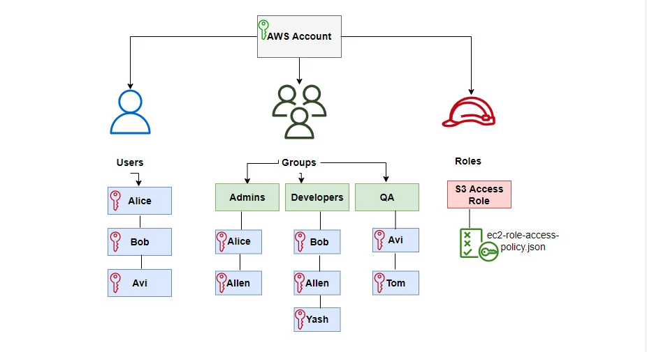

Lambda needs permission to:
- ✅ Read files from S3
- ✅ Write files to S3
- ✅ Write logs to CloudWatch

IAM Role = Identity with attached policies defining allowed actions.

**Principle of Least Privilege:** Give only the permissions needed, nothing more!

## 🚀 How It Works

### Complete Workflow
```
1. User uploads image.jpg to S3 bucket
         ↓
2. S3 sends event notification to Lambda
         ↓
3. Lambda function starts execution
         ↓
4. Lambda downloads image.jpg metadata
         ↓
5. Extracts: size, dimensions, format, timestamp
         ↓
6. Saves metadata/image_metadata.json to S3
         ↓
7. Logs everything to CloudWatch
         ↓
8. Lambda execution completes (billable: ~200ms)
```

**Total time:** < 1 second  
**Cost:** $0.000002 per execution (essentially free!)

### What Our Lambda Function Does

**For ANY file:**
- Extracts file size (bytes → human-readable)
- Gets content type (MIME type)
- Records upload timestamp
- Saves metadata as JSON

**For IMAGES specifically:**
- Downloads image temporarily
- Extracts dimensions (width × height)
- Gets image format (JPEG, PNG, etc.)
- Determines color mode (RGB, grayscale, etc.)
- Deletes temp file

**Example metadata output:**
```json
{
  "fileName": "vacation-photo.jpg",
  "bucketName": "lambda-serverless-uploads-123456789012",
  "fileSize": 2097152,
  "fileSizeReadable": "2.00 MB",
  "contentType": "image/jpeg",
  "lastModified": "2024-12-26T15:30:00",
  "uploadTime": "2024-12-26T15:30:05",
  "imageWidth": 1920,
  "imageHeight": 1080,
  "imageFormat": "JPEG",
  "imageMode": "RGB",
  "processedBy": "AWS Lambda"
}
```

## 📋 Configuration Files

### variables.tf
Defines reusable variables for infrastructure.

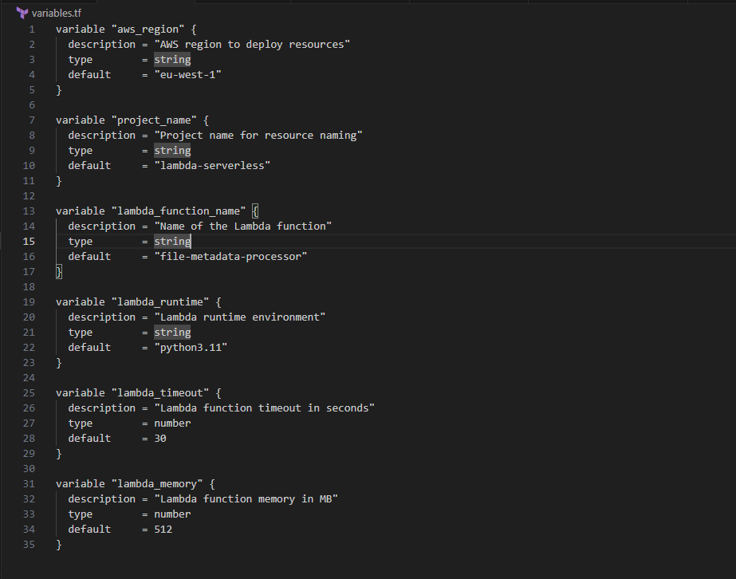

**Key variables:**
- `lambda_function_name` - Name of Lambda function
- `lambda_runtime` - Python version (3.11)
- `lambda_timeout` - Max execution time (30s)
- `lambda_memory` - RAM allocation (512 MB)

### terraform.tfvars
Contains actual values for variables.

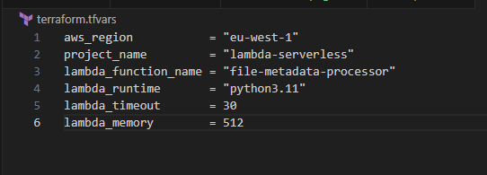

**Note:** This file is excluded from Git (may contain secrets).

### outputs.tf
Displays important information after deployment.

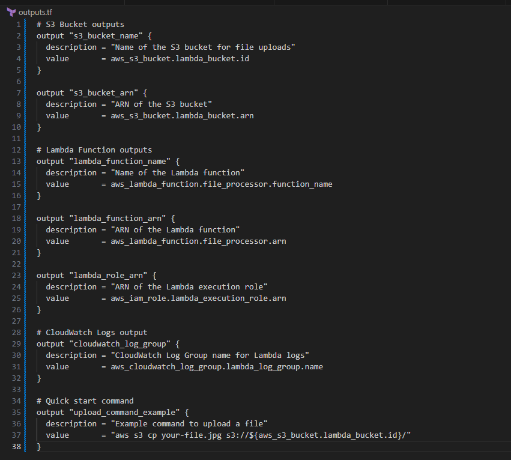

**Configured outputs:**
- `s3_bucket_name` - Bucket name for uploads
- `s3_bucket_arn` - Unique bucket identifier
- `lambda_function_name` - Lambda function name
- `lambda_function_arn` - Lambda function ARN
- `lambda_role_arn` - IAM role ARN
- `cloudwatch_log_group` - Log group path
- `upload_command_example` - Ready-to-use upload command

**Why outputs matter:**
- Quick reference to deployed resources
- Copy-paste commands for testing
- ARNs for permissions and integrations
- Easy sharing with team members

### lambda_function.py
The Python code that runs in Lambda.

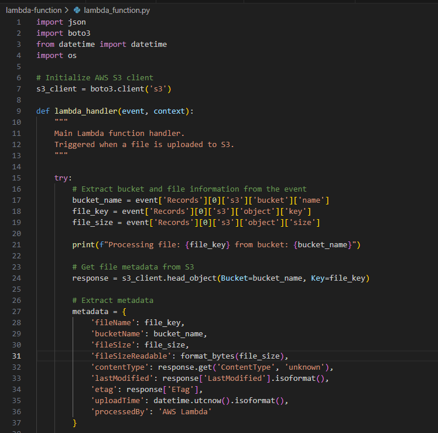
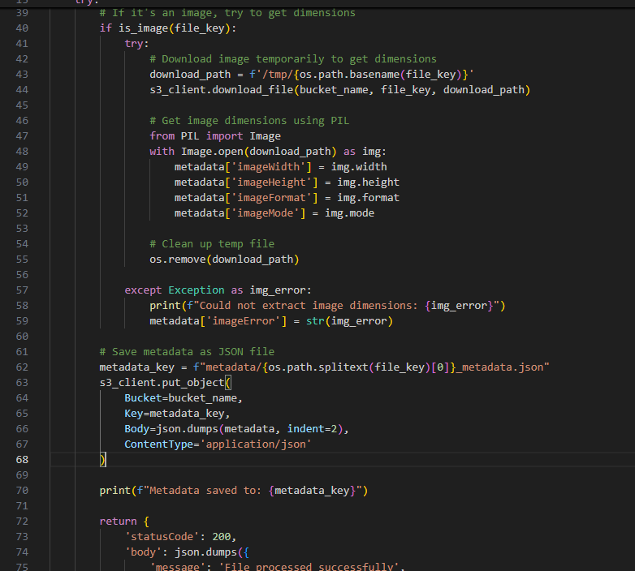
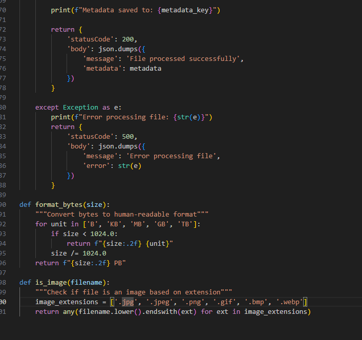

**Main sections:**
1. **Imports** - Required libraries (boto3, PIL, json)
2. **S3 Client** - Connection to S3 service
3. **lambda_handler** - Main entry point
4. **Metadata extraction** - Gets file information
5. **Image processing** - Dimensions for images
6. **JSON output** - Saves results to S3
7. **Error handling** - Graceful failure management

### requirements.txt
Python dependencies needed by Lambda.

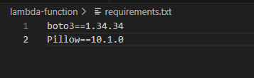
```
boto3==1.34.34   # AWS SDK (included in Lambda, but versioned)
Pillow==10.1.0   # Image processing library
```

## 🏗️ Infrastructure Components

### 1. S3 Bucket
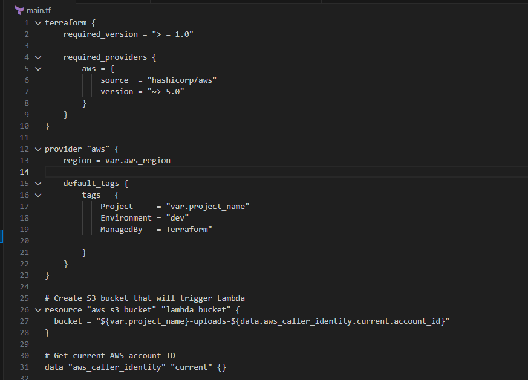
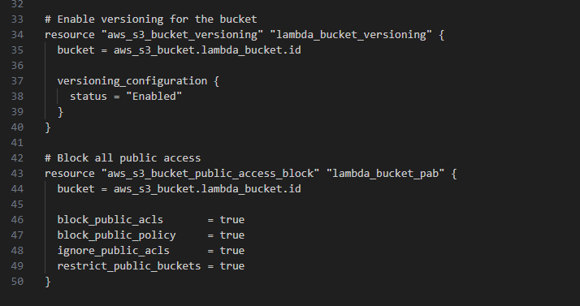

**Purpose:** Store uploaded files and trigger Lambda

**Features:**
- Versioning enabled (track file changes)
- Public access blocked (security)
- Event notifications to Lambda

**Naming:** `lambda-serverless-uploads-{account-id}`
- Globally unique (includes AWS account ID)
- Descriptive (shows purpose)

### 2. IAM Role
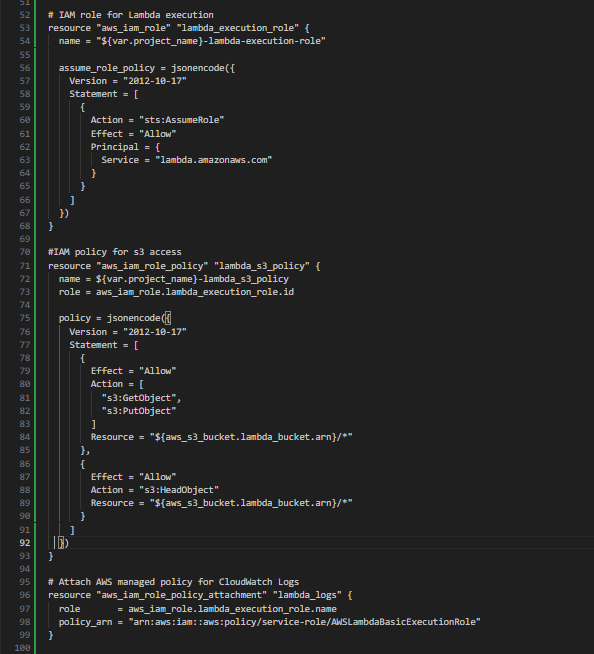

**Purpose:** Grant Lambda permissions to AWS services

**Trust Policy:**
- Allows Lambda service to assume this role
- Like giving Lambda an ID badge

**Attached Policies:**
- S3 read/write permissions
- CloudWatch log permissions
- Scoped to specific bucket (least privilege)

### 3. Lambda Function
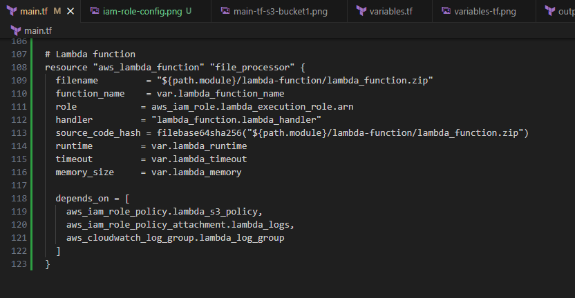

**Configuration:**
- **Runtime:** Python 3.11
- **Handler:** lambda_function.lambda_handler
- **Memory:** 512 MB (balanced performance/cost)
- **Timeout:** 30 seconds
- **Code:** Uploaded as ZIP file

**Environment Variables:**
- None needed (bucket name comes from event)

### 4. S3 Event Notification
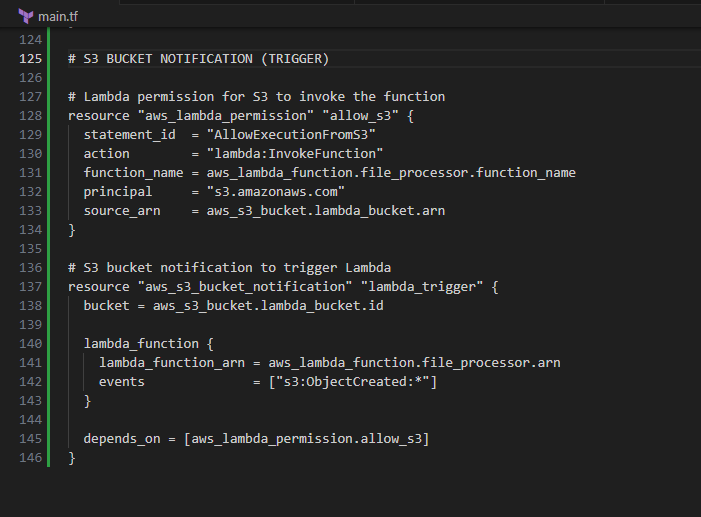

**Trigger:** ObjectCreated (any file upload)

**Filter Rules:**
- All files trigger Lambda (no prefix/suffix filters)
- Could be restricted (e.g., only `.jpg` files)

**Destination:** Lambda function ARN

### 5. CloudWatch Logs
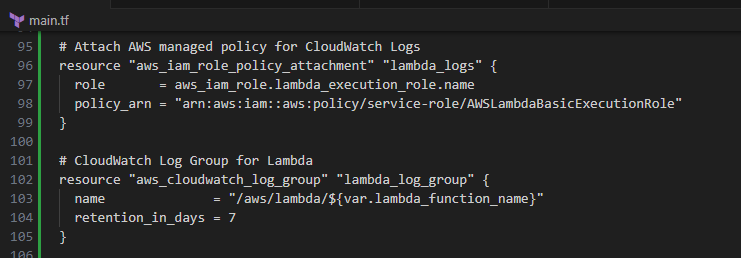

**Purpose:** Store Lambda execution logs

**Retention:** 7 days (configurable)

**Contains:**
- Print statements from Lambda
- Execution start/end times
- Errors and stack traces
- Billed duration and memory used

## ✅ Deployment Steps

### Step 1: Initialize Terraform
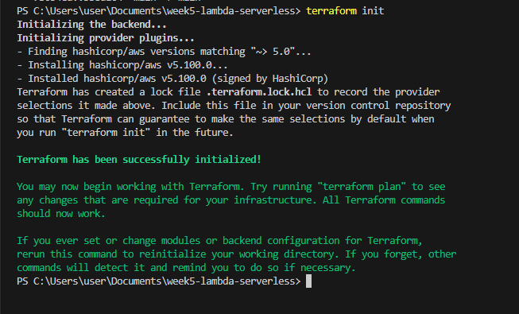
```bash
terraform init
```

**What happens:**
- Downloads AWS provider
- Initializes backend (state management)
- Creates `.terraform/` directory

### Step 2: Validate Configuration
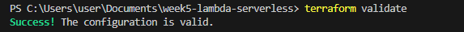
```bash
terraform validate
```

**Checks:**
- Syntax correctness
- Resource references
- Required arguments
- Valid attribute values

### Step 3: Plan Deployment
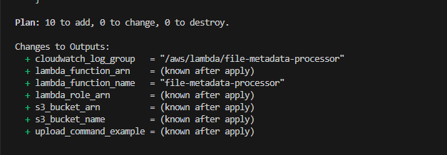
```bash
terraform plan
```

**Shows:**
- Resources to be created (7 total)
- Dependencies between resources
- Expected outputs

**Resources created:**
1. S3 bucket
2. S3 bucket versioning
3. S3 bucket public access block
4. IAM role
5. IAM role policy
6. Lambda function
7. S3 bucket notification

### Step 4: Deploy Infrastructure
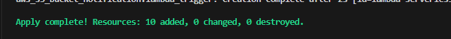
```bash
terraform apply
```

**Type `yes` to confirm**

**Deployment order (Terraform handles this):**
1. S3 bucket (no dependencies)
2. Bucket configurations (depend on bucket)
3. IAM role (no dependencies)
4. Lambda function (depends on IAM role)
5. S3 notification (depends on Lambda)

### Step 5: Verify Outputs
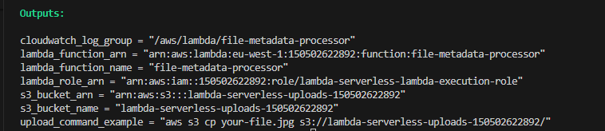
```bash
terraform output
```

**Displays:**
- S3 bucket name
- Lambda function name
- Lambda function ARN
- CloudWatch log group name

## 📊 AWS Console Verification

### Lambda Function Created
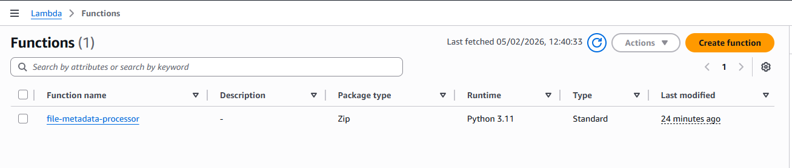

**Verify in AWS Console:**
1. Go to Lambda service
2. See your function listed
3. Check configuration (runtime, memory, timeout)
4. View code (read-only)

### S3 Bucket with Trigger
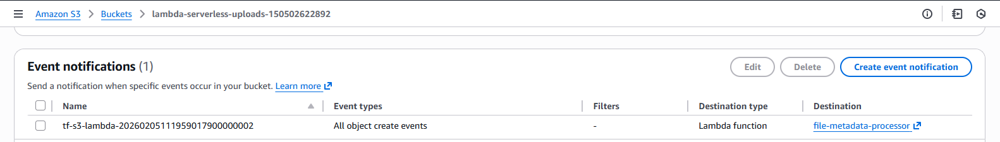

**Verify:**
1. Go to S3 service
2. Open your bucket
3. Properties tab → Event notifications
4. Should show Lambda trigger

### IAM Role Attached
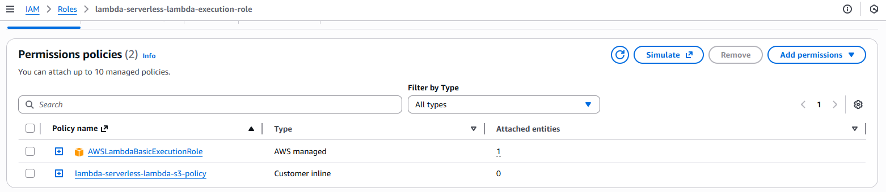

**Verify:**
1. In Lambda console
2. Configuration tab → Permissions
3. Execution role should be `lambda-execution-role`
4. Click role to see policies

### Verify CloudWatch Log Group
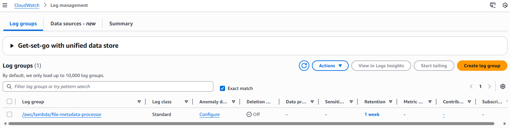

**verify**
Search for "CloudWatch"
Click "CloudWatch" service
Click "Logs" → "Log groups" in left sidebar
Find: /aws/lambda/file-metadata-processor

## 🧪 Testing the Function

### Test 1: Upload Text File
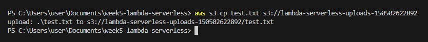
```bash
# Create test file
echo "Hello from serverless Lambda!" > test.txt

# Upload to S3
aws s3 cp test.txt s3://lambda-serverless-uploads-{account-id}/
```

**Expected result:**
- Lambda triggers automatically
- Creates `metadata/test_metadata.json`
- Logs appear in CloudWatch

### Test 2: Upload Image File
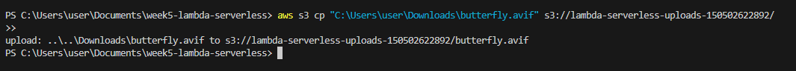
```bash
# Upload an image (use your own image)
aws s3 cp photo.jpg s3://lambda-serverless-uploads-{account-id}/
```

**Expected result:**
- Lambda extracts image dimensions
- Metadata includes width, height, format
- Saved as `metadata/photo_metadata.json`

### View Generated Metadata
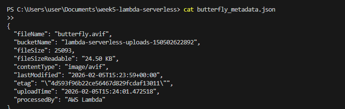
```bash
# Download metadata
aws s3 cp s3://lambda-serverless-uploads-{account-id}/metadata/photo_metadata.json ./

# View contents
cat photo_metadata.json
```

**Should show complete metadata with image dimensions!**

### Check CloudWatch Logs
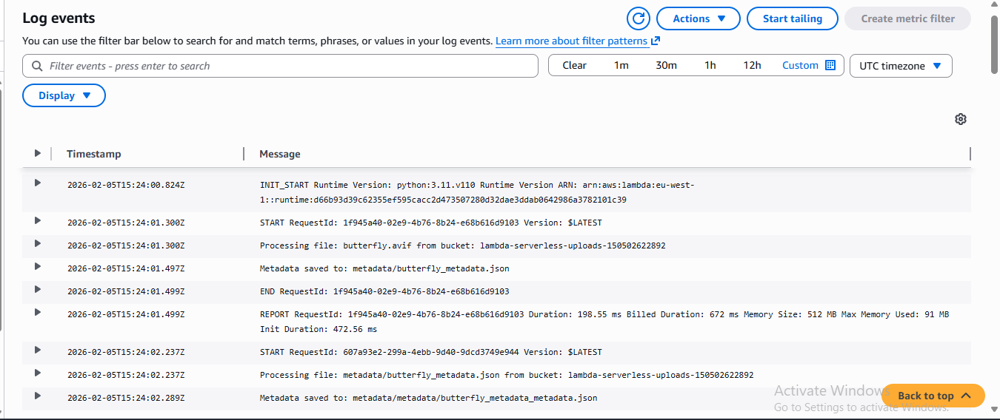

**In AWS Console:**
1. Go to CloudWatch
2. Logs → Log groups
3. Find `/aws/lambda/file-metadata-processor`
4. Click latest log stream
5. See Lambda execution logs

**Log contents:**
```
START RequestId: abc-123-def-456
Processing file: photo.jpg from bucket: lambda-serverless-uploads-123456789012
Metadata saved to: metadata/photo_metadata.json
END RequestId: abc-123-def-456
REPORT RequestId: abc-123-def-456
Duration: 234.56 ms
Billed Duration: 235 ms
Memory Size: 512 MB
Max Memory Used: 89 MB
```

### Test 3: Upload Multiple Files
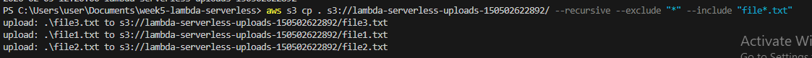
```bash
# Upload several files at once
aws s3 cp sample-files/ s3://lambda-serverless-uploads-{account-id}/ --recursive
```

**Lambda processes each file independently!**
- Multiple concurrent executions
- Auto-scaling in action
- No server management needed

## 💡 Key Learnings

### Serverless Benefits
- **No server management** - AWS handles everything
- **Automatic scaling** - From 0 to millions of requests
- **Pay per use** - Billed by execution time (not uptime)
- **High availability** - AWS manages redundancy
- **Focus on code** - Not infrastructure

### Event-Driven Architecture
- **Decoupled components** - S3 and Lambda are independent
- **Asynchronous processing** - Upload returns immediately
- **Scalable** - Each upload triggers separate execution
- **Resilient** - Failed executions don't affect others

### IAM Best Practices
- **Least privilege** - Grant only needed permissions
- **Resource-specific** - Permissions scoped to specific bucket
- **No hardcoded credentials** - IAM roles handle authentication
- **Auditable** - CloudTrail logs all API calls

### Lambda Considerations
- **Cold starts** - First execution takes longer (~1-2 seconds)
- **Stateless** - Each execution is independent (use S3/database for persistence)
- **Timeout limits** - Max 15 minutes per execution
- **/tmp storage** - 512 MB temporary storage per execution
- **Memory = CPU** - More memory = more CPU power

### Cost Optimization
- **Right-size memory** - Don't over-allocate
- **Set appropriate timeout** - Prevent runaway executions
- **Use free tier** - 1 million requests/month free forever
- **Monitor usage** - CloudWatch metrics show execution counts

## 📊 Cost Analysis

### Lambda Pricing Breakdown

**Free Tier (Monthly, Forever):**
- 1,000,000 requests
- 400,000 GB-seconds compute time

**Our Function:**
- Memory: 512 MB (0.5 GB)
- Duration: ~200ms (0.2 seconds)
- Compute: 0.5 GB × 0.2s = 0.1 GB-seconds per execution

**Example usage:**
- 10,000 executions/month
- Total compute: 10,000 × 0.1 = 1,000 GB-seconds
- **Within free tier! Cost: $0**

**Beyond free tier:**
- Requests: $0.20 per 1 million
- Compute: $0.0000166667 per GB-second

**Compared to EC2 t3.micro:**
- EC2: ~$7.50/month (running 24/7)
- Lambda: $0 for typical usage
- **Savings: 100%!**

### S3 Costs
- Storage: $0.023/GB/month
- Requests: Negligible for our use case
- **Example:** 10 GB data = $0.23/month

**Total project cost: ~$0.23/month** (just S3 storage!)

## 🔗 Resources

- [AWS Lambda Documentation](https://docs.aws.amazon.com/lambda/)
- [Boto3 Documentation](https://boto3.amazonaws.com/v1/documentation/api/latest/index.html)
- [Pillow Documentation](https://pillow.readthedocs.io/)
- [Terraform AWS Provider - Lambda](https://registry.terraform.io/providers/hashicorp/aws/latest/docs/resources/lambda_function)
- [AWS Lambda Pricing](https://aws.amazon.com/lambda/pricing/)
- [Serverless Best Practices](https://docs.aws.amazon.com/lambda/latest/dg/best-practices.html)

## 📝 Next Steps

**Week 6:** CI/CD Pipeline for Infrastructure (GitHub Actions + Terraform)

**Enhancements for this project:**
- Add error notifications (SNS/Email)
- Process images (resize, thumbnail generation)
- Support more file types (PDFs, videos)
- Add DynamoDB to track all processed files
- Create API Gateway endpoint for manual triggers

## 🧹 Cleanup

**To avoid charges, destroy resources when done:**

### Step 1: Empty S3 Bucket
```bash
# Remove all files
aws s3 rm s3://lambda-serverless-uploads-{account-id} --recursive
```

**Why?** Terraform can't delete buckets with contents.

### Step 2: Destroy Infrastructure
```bash
terraform destroy
```

**Type `yes` to confirm**

**What gets deleted:**
- Lambda function
- IAM role and policies
- S3 bucket (now empty)
- CloudWatch log group
- S3 event notification

**Verify deletion in AWS Console!**

## 🎯 Project Checklist

- [ ] Lambda function code written and tested locally
- [ ] Python dependencies defined (requirements.txt)
- [ ] Deployment package created (ZIP)
- [ ] Terraform infrastructure defined
- [ ] IAM roles and permissions configured
- [ ] S3 bucket created with event notifications
- [ ] Infrastructure deployed with `terraform apply`
- [ ] Function tested with file uploads
- [ ] CloudWatch logs verified
- [ ] Metadata files generated successfully
- [ ] Screenshots captured for documentation
- [ ] Code committed to GitHub
- [ ] LinkedIn post published
- [ ] Resources destroyed to avoid charges

---

**Author:** [Your Name]  
**Date:** December 2024  
**Part of:** 12-Week Cloud Computing Project Challenge  
**Repository:** https://github.com/YOUR-USERNAME/week5-lambda-serverless