# Week 6: CI/CD Pipeline with GitHub Actions & Terraform

## 📋 Project Overview

This project demonstrates a complete **CI/CD (Continuous Integration/Continuous Deployment)** pipeline using GitHub Actions to automatically deploy AWS infrastructure with Terraform. Every time code is pushed to the main branch, the infrastructure is validated, planned, and deployed to AWS automatically — no manual `terraform apply` needed!

**Built on Week 5 Lambda infrastructure, now fully automated.**

---

## 🎯 Learning Objectives

- Understand what CI/CD is and why it matters in real DevOps jobs
- Build automated GitHub Actions workflows from scratch
- Store AWS credentials securely using GitHub Secrets
- Automate Terraform validate, plan, and apply in a pipeline
- Package and deploy Lambda functions automatically
- Debug and fix real pipeline errors

---

## 🛠️ Tools & Technologies

| Tool | Purpose |
|------|---------|
| GitHub Actions | CI/CD automation platform (free!) |
| Terraform | Infrastructure as Code |
| AWS Lambda | Serverless function (Python 3.11) |
| AWS S3 | File storage with event triggers |
| AWS IAM | Permissions and access control |
| AWS CloudWatch | Logs and monitoring |
| Python 3.11 | Lambda runtime |
| Git & GitHub | Version control + automation trigger |

---

## 📂 Project Structure

```
week6-cicd-terraform-automation/
├── .github/
│   └── workflows/
│       └── deploy.yml        ← GitHub Actions workflow (the magic!)
├── lambda-function/
│   ├── lambda_function.py    ← Python code for Lambda
│   ├── requirements.txt      ← Python dependencies (Pillow)
│   └── package/              ← Auto-generated by workflow
├── screenshots/              ← All documentation screenshots go here
├── main.tf                   ← Main Terraform infrastructure
├── variables.tf              ← Variable definitions
├── outputs.tf                ← Deployment output values
├── terraform.tfvars          ← Variable values (excluded from Git)
├── .gitignore                ← Protects sensitive files
└── README.md                 ← This file
```

---

## 🧠 What is CI/CD?

### Before CI/CD (Weeks 3–5 — Manual):
```
Write code → terraform fmt → terraform validate
→ terraform plan → terraform apply → check AWS
→ repeat every single time 😩
```

### After CI/CD (Week 6 — Automated!):
```
Write code → git push 🚀
→ GitHub Actions does EVERYTHING automatically
→ Check AWS — it's already deployed! ☕
```

**GitHub Actions is the robot that replaces all the manual steps, every single time, with zero human error.**

---

## 🏗️ Infrastructure Deployed (10 Resources)

| # | Resource | Name |
|---|---------|------|
| 1 | S3 Bucket | lambda-serverless-uploads-{account-id} |
| 2 | S3 Versioning | Enabled |
| 3 | S3 Public Access Block | All 4 settings blocked |
| 4 | IAM Role | lambda-serverless-lambda-execution-role |
| 5 | IAM S3 Policy | lambda-serverless-lambda-s3-policy |
| 6 | IAM CloudWatch Attachment | AWSLambdaBasicExecutionRole |
| 7 | CloudWatch Log Group | /aws/lambda/file-metadata-processor |
| 8 | Lambda Function | file-metadata-processor |
| 9 | Lambda Permission | Allow S3 to invoke Lambda |
| 10 | S3 Bucket Notification | Trigger Lambda on any upload |

---

## 📸 SCREENSHOT 1 — VS Code Project Structure

> 📷 **HOW TO TAKE:** Open VS Code. In the Explorer (left panel), expand all folders — especially `.github/workflows/`. Take a screenshot showing all files. Save as `screenshots/01-project-structure.png`

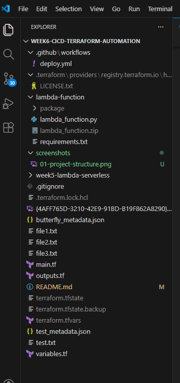

---

## ⚙️ The GitHub Actions Workflow

The entire automation lives in `.github/workflows/deploy.yml`. This file tells GitHub when to run, what machine to use, and what steps to execute.

**Trigger — when does it run?**
```yaml
on:
  push:
    branches:
      - main        # Deploys when you push to main ✅
  pull_request:
    branches:
      - main        # Only validates on PRs — no deploy ❌
```

**The conditional deploy — most important line!**
```yaml
- name: Terraform Apply
  if: github.ref == 'refs/heads/main' && github.event_name == 'push'
  run: terraform apply -auto-approve -input=false
```

This means push to main = full deploy. Pull request = validate only.

---

## 📸 SCREENSHOT 2 — Workflow YAML File in VS Code

> 📷 **HOW TO TAKE:** In VS Code, click on `.github/workflows/deploy.yml` to open it. Screenshot the full file content visible in the editor. Save as `screenshots/02-workflow-yaml.png`

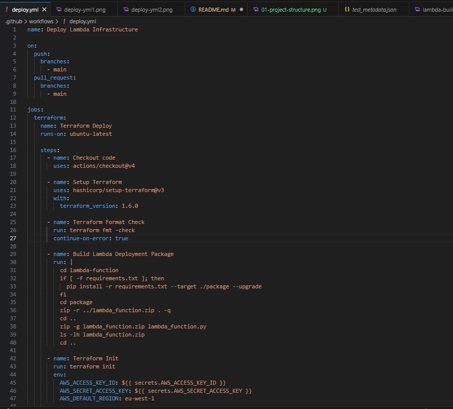
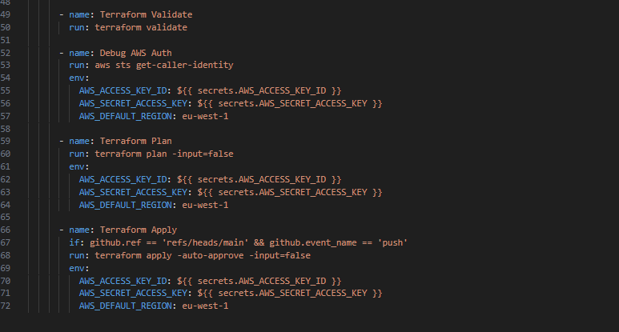

---

## 🔐 Setting Up AWS Credentials Securely

### IAM User for GitHub Actions

A dedicated IAM user called `github-actions-terraform` was created — never using personal credentials for automation!

---

## 📸 SCREENSHOT 3 — IAM User in AWS Console

> 📷 **HOW TO TAKE:** AWS Console → IAM → Users. Find and screenshot `github-actions-terraform` in the list. Save as `screenshots/03-iam-user-created.png`

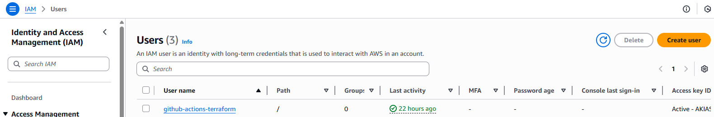

---

### GitHub Secrets

AWS credentials are stored encrypted in GitHub — never in code or Git history!

```yaml
# How workflow uses secrets — always shows as *** in logs!
env:
  AWS_ACCESS_KEY_ID: ${{ secrets.AWS_ACCESS_KEY_ID }}
  AWS_SECRET_ACCESS_KEY: ${{ secrets.AWS_SECRET_ACCESS_KEY }}
```

---

## 📸 SCREENSHOT 4 — GitHub Secrets Page

> 📷 **HOW TO TAKE:** Your GitHub repo → Settings → Secrets and variables → Actions. Screenshot showing BOTH secrets listed. Values will be hidden — that is correct and expected! Save as `screenshots/04-github-secrets.png`

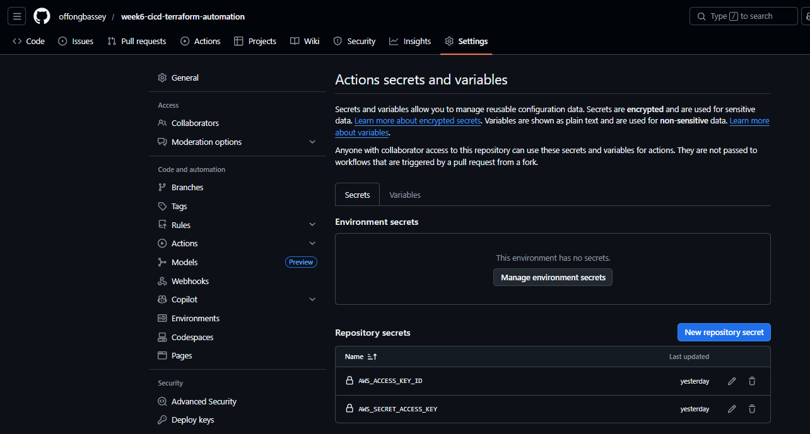

---

## 🔄 Pipeline Flow (What Happens After git push)

```
git push origin main
        ↓
GitHub detects push to main branch
        ↓
GitHub starts fresh Ubuntu VM (free!)
        ↓
Step 1: Download repo code          (2s)
Step 2: Install Terraform 1.6.0     (1s)
Step 3: Check code formatting       (0s)
Step 4: Build Lambda ZIP package    (30s) ← KEY STEP!
Step 5: terraform init              (10s)
Step 6: terraform validate          (1s)
Step 7: terraform plan              (5s)
Step 8: terraform apply             (10s) ← DEPLOYS TO AWS!
        ↓
10 AWS resources created in AWS
        ↓
Total time: ~57 seconds ✅
```

**Why Step 4 matters:** The ZIP is in `.gitignore` so GitHub never has it.
The workflow builds it automatically every single run:
```bash
pip install -r requirements.txt --target ./package
cd package && zip -r ../lambda_function.zip . -q
zip -g lambda_function.zip lambda_function.py
```

---

## 🐛 Real Error We Fixed

**Error on first pipeline run:**
```
Error: open lambda-function/lambda_function.zip: no such file or directory
```

Root cause: ZIP excluded from Git via `.gitignore`

Fix: Added "Build Lambda Deployment Package" step to create it automatically inside the pipeline. Professional solution — no committing ZIP files!

---

## 📸 SCREENSHOT 5 — Failed Workflow Run (Learning Moment!)

> 📷 **HOW TO TAKE:** GitHub → Actions tab → Find the failed run (red X icon). Click into it and screenshot the error message showing "no such file or directory". Save as `screenshots/05-pipeline-error.png`

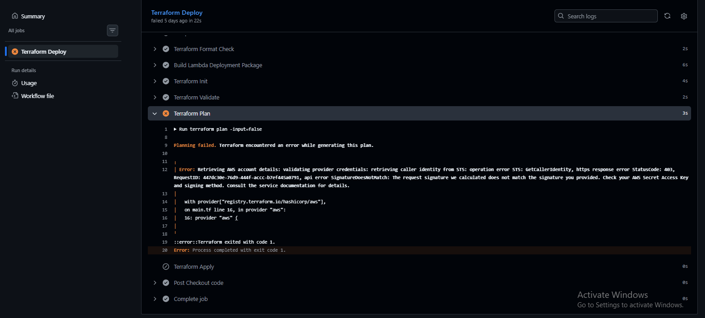

---

## 🎉 Successful Deployment

After adding the Lambda package build step, the pipeline succeeded!

---

## 📸 SCREENSHOT 6 — GitHub Actions Success ⭐ (Most Important!)

> 📷 **HOW TO TAKE:** GitHub repo → Actions tab. Find the successful run with the green checkmark ✅. Screenshot showing the run name, "main" branch badge, and the time taken (57s). Save as `screenshots/06-github-actions-success.png`

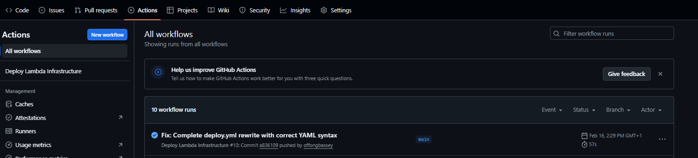

---

## 📸 SCREENSHOT 7 — All Pipeline Steps Green

> 📷 **HOW TO TAKE:** Click on the successful run → Click "Terraform Deploy" job → Expand ALL steps. Screenshot showing every single step with a green checkmark. Save as `screenshots/07-all-steps-green.png`

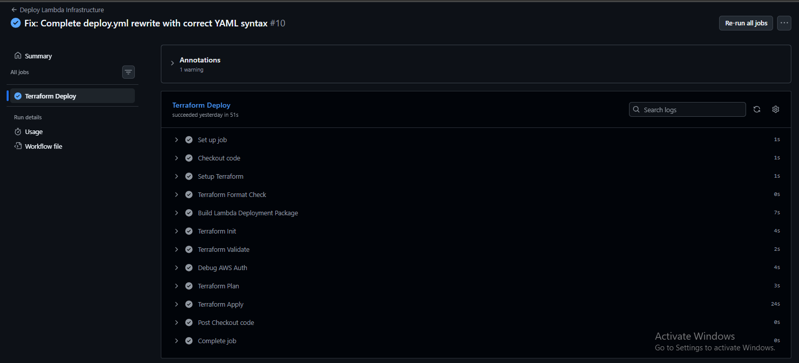

---

## 📸 SCREENSHOT 8 — Terraform Apply Output in Logs

> 📷 **HOW TO TAKE:** Inside the workflow run logs, click the "Terraform Apply" step to expand it. Screenshot showing "Apply complete! Resources: 10 added, 0 changed, 0 destroyed" and the Outputs section. Save as `screenshots/08-terraform-apply-output.png`

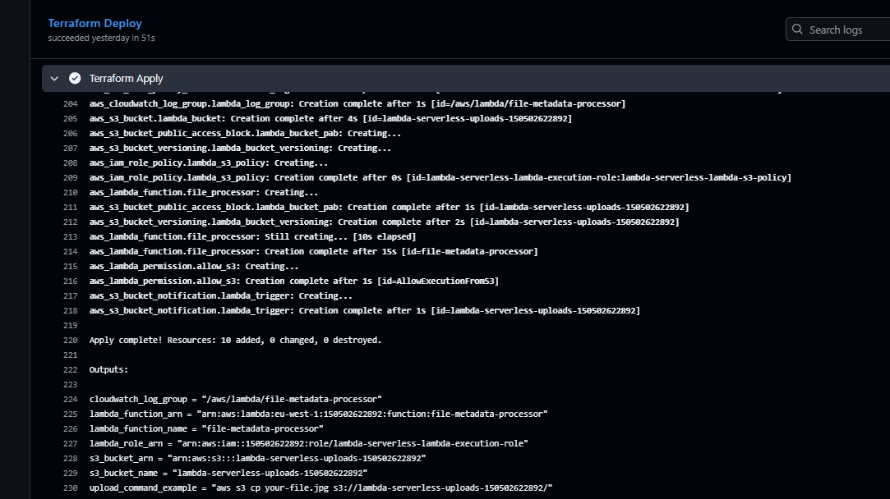

---

## ✅ AWS Console Verification

### Lambda Function

---

## 📸 SCREENSHOT 9 — Lambda Function in AWS Console

> 📷 **HOW TO TAKE:** AWS Console → Lambda → Functions. Screenshot showing `file-metadata-processor` in the list with Python 3.11 runtime and a recent "Last modified" timestamp. Save as `screenshots/09-lambda-deployed.png`

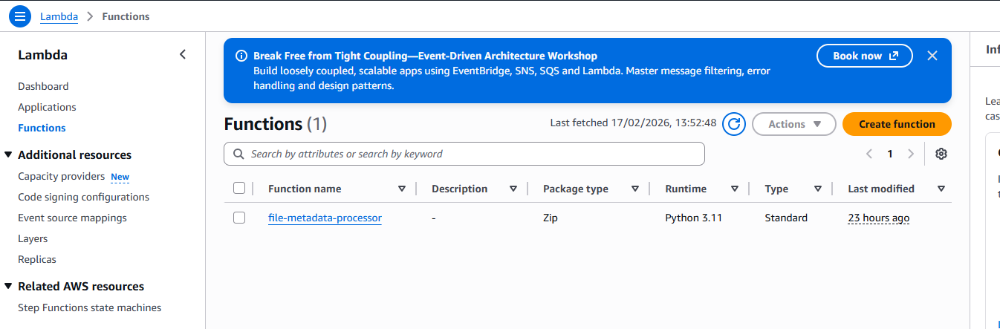

---

## 📸 SCREENSHOT 10 — Lambda Configuration Tab

> 📷 **HOW TO TAKE:** Click `file-metadata-processor` → Configuration tab → General configuration. Screenshot showing Memory: 512 MB and Timeout: 30 seconds. Save as `screenshots/10-lambda-config.png`

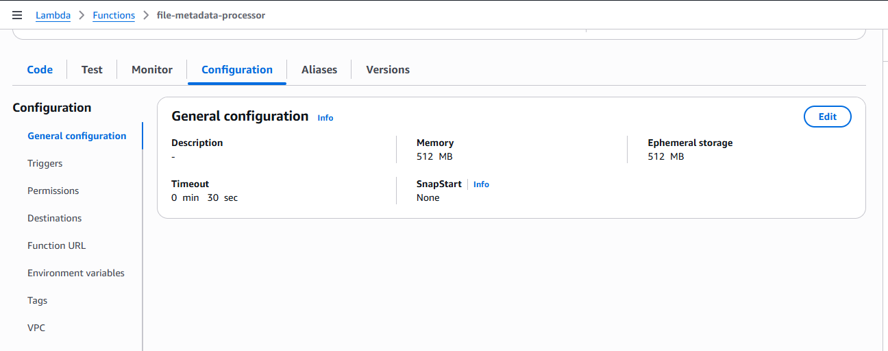

---

### S3 Bucket

---

## 📸 SCREENSHOT 11 — S3 Bucket in AWS Console

> 📷 **HOW TO TAKE:** AWS Console → S3. Screenshot showing `lambda-serverless-uploads-{your-account-id}` in the bucket list with eu-west-1 region and creation date. Save as `screenshots/11-s3-bucket.png`

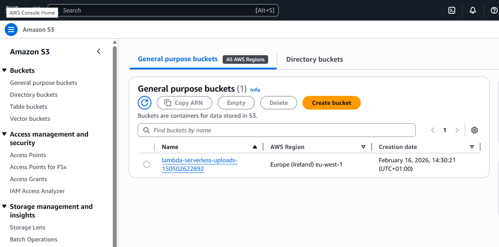

---

## 📸 SCREENSHOT 12 — S3 Bucket Properties

> 📷 **HOW TO TAKE:** Click your S3 bucket → Properties tab. Screenshot showing Bucket Versioning: Enabled and Default encryption section. Save as `screenshots/12-s3-properties.png`

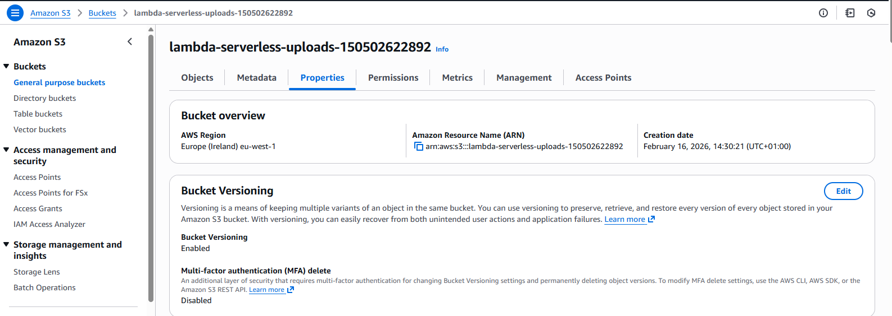
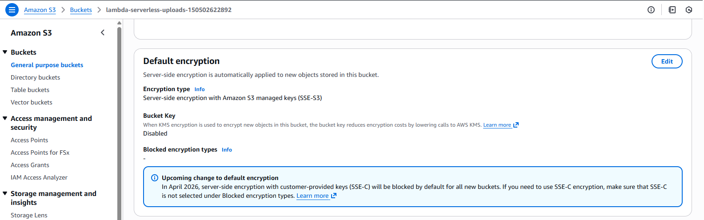
---

### IAM Role

---

## 📸 SCREENSHOT 13 — IAM Role in AWS Console

> 📷 **HOW TO TAKE:** AWS Console → IAM → Roles → Search `lambda-serverless-lambda-execution-role`. Screenshot showing it in the results list. Save as `screenshots/13-iam-role.png`

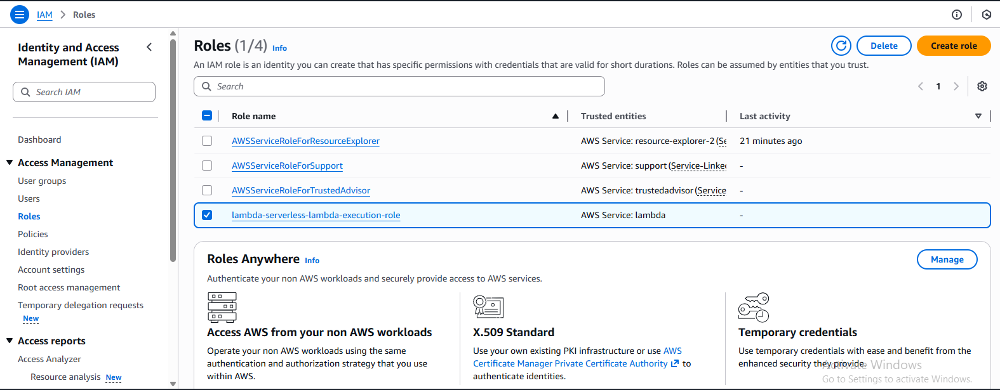

---

### CloudWatch Logs

---

## 📸 SCREENSHOT 14 — CloudWatch Log Group

> 📷 **HOW TO TAKE:** AWS Console → CloudWatch → Log groups. Screenshot showing `/aws/lambda/file-metadata-processor` in the list with 7 days retention. Save as `screenshots/14-cloudwatch-log-group.png`

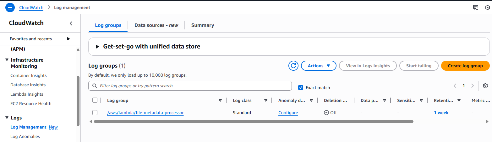

---

## 🧪 Testing the Lambda Function

```bash
# Upload a test file — Lambda triggers automatically!
echo "Hello from CI/CD Week 6!" > test.txt
aws s3 cp test.txt s3://lambda-serverless-uploads-150502622892/
```

Lambda processes it and saves a metadata JSON to S3:

```json
{
  "fileName": "test.txt",
  "bucketName": "lambda-serverless-uploads-150502622892",
  "fileSize": 26,
  "fileSizeReadable": "26.00 B",
  "contentType": "text/plain",
  "uploadTime": "2026-02-16T14:50:22"
}
```

---

## 📸 SCREENSHOT 15 — Lambda Execution Logs in CloudWatch

> 📷 **HOW TO TAKE:** CloudWatch → Log groups → `/aws/lambda/file-metadata-processor` → Click a log stream. Screenshot the execution showing START, processing messages, END, and the REPORT line (Duration, Memory Used). Save as `screenshots/15-lambda-execution-logs.png`


---

## 💡 Key Learnings

### CI/CD Value

| Before CI/CD | After CI/CD |
|-------------|------------|
| ~15 minutes manual deploy | 57 seconds automated |
| Easy to forget steps | Every step always runs |
| Human errors possible | Zero human error |
| No record of deployments | Full log of every run |
| Hard to collaborate | Team deploys safely |

### Security Lessons

- ✅ Never commit AWS credentials to Git (use GitHub Secrets!)
- ✅ Dedicated IAM user for automation — not personal credentials
- ✅ Programmatic access only — robots do not need console login
- ✅ Block all S3 public access — 4-layer protection
- ✅ Credentials always show as `***` in pipeline logs

### Debugging is Normal!

The pipeline failed on the first attempt. That is completely normal in real DevOps work. The key skill is reading the error message carefully and finding the fix. We went from error to success systematically, exactly like professional engineers do every day.

---

## 📊 Deployment Summary

| Metric | Value |
|--------|-------|
| Resources deployed | 10 AWS resources |
| Deployment time | 57 seconds |
| Manual steps | 0 (fully automated!) |
| Pipeline runs total | 10 (debugging included) |
| AWS region | eu-west-1 (Europe/Ireland) |
| Monthly cost | ~$0 (within free tier) |

---

## 🧹 Cleanup — Avoid AWS Charges!

When done testing, destroy all resources:

```bash
terraform init
terraform destroy
# Type 'yes' when prompted
```

Expected output:
```
Destroy complete! Resources: 10 destroyed.
```

**After destroy: $0 charges** ✅

---

## ✅ Screenshot Checklist

Track which screenshots you still need to take:

- [ ] `01-project-structure.png` — VS Code Explorer with all files visible
- [ ] `02-workflow-yaml.png` — deploy.yml open in VS Code editor
- [ ] `03-iam-user-created.png` — github-actions-terraform user in IAM
- [ ] `04-github-secrets.png` — Both secrets in GitHub Settings
- [ ] `05-pipeline-error.png` — The failed run showing the ZIP error
- [ ] `06-github-actions-success.png` — Green checkmark workflow ⭐
- [ ] `07-all-steps-green.png` — All pipeline steps expanded and green
- [ ] `08-terraform-apply-output.png` — "Apply complete! 10 added" in logs
- [ ] `09-lambda-deployed.png` — Lambda function in AWS Console
- [ ] `10-lambda-config.png` — Lambda Configuration tab
- [ ] `11-s3-bucket.png` — S3 bucket in AWS Console
- [ ] `12-s3-properties.png` — S3 Properties (versioning + encryption on)
- [ ] `13-iam-role.png` — IAM role in AWS Console
- [ ] `14-cloudwatch-log-group.png` — CloudWatch log group
- [ ] `15-lambda-execution-logs.png` — Lambda execution logs

---

## 🔗 Resources

- [GitHub Actions Documentation](https://docs.github.com/en/actions)
- [Terraform AWS Provider](https://registry.terraform.io/providers/hashicorp/aws/latest/docs)
- [AWS Lambda Documentation](https://docs.aws.amazon.com/lambda/)
- [GitHub Secrets Guide](https://docs.github.com/en/actions/security-guides/encrypted-secrets)

---

## 📝 Week 7 Ideas

- **Cloud Monitoring** — CloudWatch dashboards and billing alarms
- **Auto Scaling** — Scale EC2 automatically based on load
- **Load Balancer** — Distribute traffic across multiple servers
- **Advanced IAM** — Fine-grained security policies

---

## 👨‍💻 Author

**Offong Bassey**
GitHub: [@offongbassey](https://github.com/offongbassey)
Completed: February 16, 2026
Part of: 12-Week Cloud Computing Challenge

---

*This infrastructure was deployed automatically by GitHub Actions — zero manual steps! 🤖*
