# Week 6-7: CI/CD Pipeline + Cloud Monitoring & Observability

## 📋 Project Overview

This project demonstrates a **complete DevOps workflow** combining automated infrastructure deployment (Week 6) with production-grade cloud monitoring (Week 7). The system automatically deploys AWS Lambda infrastructure via GitHub Actions and provides real-time observability through custom CloudWatch metrics, intelligent alarms, and SNS notifications — **all managed as Infrastructure as Code with Terraform**.

**Key Achievement:** 100% automated infrastructure and monitoring deployment. One `git push` deploys everything!

---

## 🎯 Learning Objectives

### Week 6: CI/CD & Automation
- Build GitHub Actions workflows for automated deployment
- Implement Terraform remote state with S3 backend
- Secure credential management with GitHub Secrets
- Debug and resolve state drift issues

### Week 7: Monitoring & Observability
- Understand the difference between monitoring and observability
- Implement custom CloudWatch metrics for business logic
- Create intelligent alarms with SNS notifications
- Automate monitoring resources with Terraform (Infrastructure as Code)
- Debug Lambda triggers and IAM permissions

---

## 🛠️ Complete Tech Stack

| Technology | Purpose | Week |
|-----------|---------|------|
| **GitHub Actions** | CI/CD automation | Week 6 |
| **Terraform** | Infrastructure as Code | Week 6-7 |
| **AWS Lambda** | Serverless compute (Python 3.11) | Week 5-7 |
| **AWS S3** | File storage + event triggers | Week 5-7 |
| **AWS IAM** | Permissions & security | Week 5-7 |
| **CloudWatch Logs** | Execution logging | Week 7 |
| **CloudWatch Metrics** | Performance tracking | Week 7 |
| **CloudWatch Alarms** | Automated notifications | Week 7 |
| **SNS** | Email/SMS alerts | Week 7 |

---

## 📂 Project Structure

```
week6-cicd-terraform-automation/
├── .github/
│   └── workflows/
│       └── deploy.yml              ← GitHub Actions CI/CD pipeline
├── lambda-function/
│   ├── lambda_function.py          ← Lambda with custom metrics
│   ├── requirements.txt            ← Python dependencies (empty - no Pillow)
│   └── lambda_function.zip         ← Deployment package (auto-built)
├── screenshots/
│   ├── Week 6 Screenshots/
│   │   ├── 01-github-actions-success.png
│   │   ├── 02-terraform-apply-output.png
│   │   └── 03-s3-backend-configured.png
│   └── Week 7 Screenshots/
│       ├── 04-cloudwatch-logs-execution.png
│       ├── 05-lambda-code-metrics.png
│       ├── 06-custom-namespace.png
│       ├── 07-custom-metrics-graphs.png
│       ├── 08-logs-metric-publishing.png
│       ├── 09-sns-topic-created.png
│       ├── 10-email-subscription-confirmed.png
│       ├── 11-alarm-configuration.png
│       ├── 12-all-alarms-list.png
│       ├── 13-alarm-email-notification.png
│       └── 14-terraform-monitoring.png
├── main.tf                         ← Infrastructure definition
├── monitoring.tf                   ← CloudWatch alarms + SNS (NEW!)
├── variables.tf                    ← Variable definitions
├── outputs.tf                      ← Output values
├── terraform.tfvars                ← Values (excluded from Git)
├── .gitignore                      ← Protected files
└── README.md                       ← This file
```

---

## 🧠 Key Concepts Explained

### What is CI/CD?

**CI/CD = Continuous Integration / Continuous Deployment**

**Manual Deployment (Weeks 3-5):**
```
Write code → terraform validate → terraform plan 
→ terraform apply → type 'yes' → wait → check AWS
→ Repeat for every change! 😩
Time: ~15 minutes per deployment
```

**Automated Deployment (Week 6-7):**
```
Write code → git push 🚀
→ GitHub Actions does EVERYTHING automatically:
  - Validates code
  - Plans changes
  - Deploys infrastructure (Lambda, S3, IAM)
  - Creates monitoring (Alarms, SNS)
→ Infrastructure deployed in 57 seconds! ☕
Time: ~1 minute, zero manual steps
```

**Time saved:** 14 minutes per deployment × 10 deployments/week = **2.3 hours saved per week!**

---

### What is Monitoring vs Observability?

**Monitoring = Looking at dashboards**
- Shows WHAT happened
- Example: "Lambda executed 50 times today"

**Observability = Understanding WHY something happened**
- Shows WHY it happened and HOW to fix it
- Example: "Lambda executed 50 times today because a user uploaded 50 files, average processing time was 234ms, memory usage was 67MB out of 512MB allocated, all executions succeeded, and the largest file was 2.5MB"

---

### What is Infrastructure as Code (IaC)?

**Traditional Approach (Manual):**
```
1. Go to AWS Console
2. Click through 20 different pages
3. Fill in forms
4. Create resources
5. Hope you remember what you did
6. Can't recreate it easily
```

**Infrastructure as Code (Terraform):**
```
1. Write code describing what you want
2. terraform apply
3. Infrastructure created automatically
4. Version controlled in Git
5. Can recreate identically anytime
6. Can destroy and rebuild in minutes
```

**This project demonstrates IaC for:**
- ✅ Lambda functions
- ✅ S3 buckets
- ✅ IAM roles
- ✅ CloudWatch alarms ← Added in Week 7!
- ✅ SNS topics ← Added in Week 7!

---

## 🏗️ Week 6: CI/CD Pipeline Implementation

### Infrastructure Deployed (10 Resources)

| # | Resource | Name | Purpose |
|---|---------|------|---------|
| 1 | S3 Bucket | lambda-serverless-uploads-{account-id} | File storage |
| 2 | S3 Versioning | Enabled | File history tracking |
| 3 | S3 Public Access Block | All blocked | Security layer |
| 4 | IAM Role | lambda-serverless-lambda-execution-role | Lambda permissions |
| 5 | IAM S3 Policy | lambda-serverless-lambda-s3-policy | S3 access |
| 6 | IAM CloudWatch Policy | CloudWatch metric publishing | Monitoring access |
| 7 | CloudWatch Log Group | /aws/lambda/file-metadata-processor | Log storage |
| 8 | Lambda Function | file-metadata-processor | File processor |
| 9 | Lambda Permission | AllowS3Invoke | S3 trigger permission |
| 10 | S3 Bucket Notification | ObjectCreated:* | Lambda trigger |

---

## 📸 SCREENSHOT 1 — VS Code Project Structure

> 📷 **HOW TO TAKE:** Open VS Code. In the Explorer (left panel), expand all folders — especially `.github/workflows/`. Take a screenshot showing all files. Save as `screenshots/01-project-structure.png`

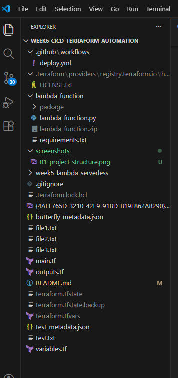

---

## ⚙️ The GitHub Actions Workflow

The entire automation lives in `.github/workflows/deploy.yml`. This file tells GitHub when to run, what machine to use, and what steps to execute.

**Trigger — when does it run?**
```yaml
on:
  push:
    branches:
      - main        # Deploys when you push to main ✅
  pull_request:
    branches:
      - main        # Only validates on PRs — no deploy ❌
```

**The conditional deploy — most important line!**
```yaml
- name: Terraform Apply
  if: github.ref == 'refs/heads/main' && github.event_name == 'push'
  run: terraform apply -auto-approve -input=false
```

This means push to main = full deploy. Pull request = validate only.

---

## 📸 SCREENSHOT 2 — Workflow YAML File in VS Code

> 📷 **HOW TO TAKE:** In VS Code, click on `.github/workflows/deploy.yml` to open it. Screenshot the full file content visible in the editor. Save as `screenshots/02-workflow-yaml.png`

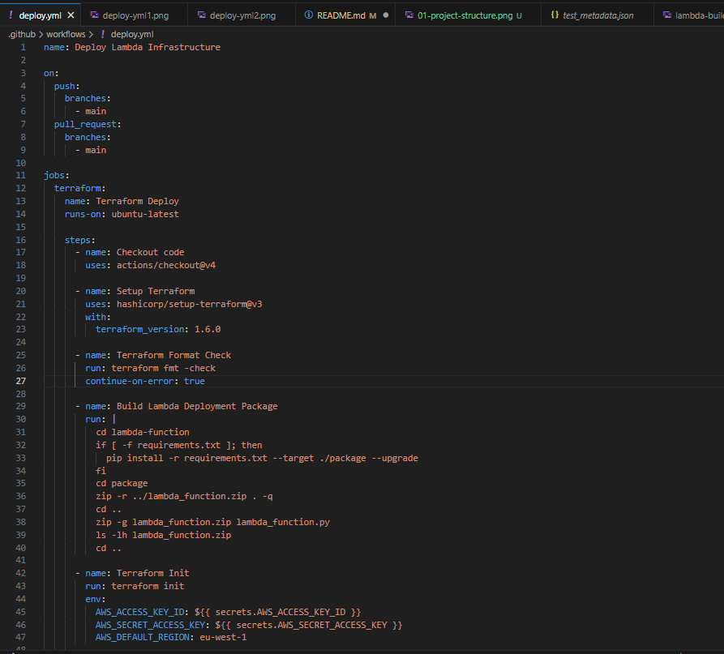
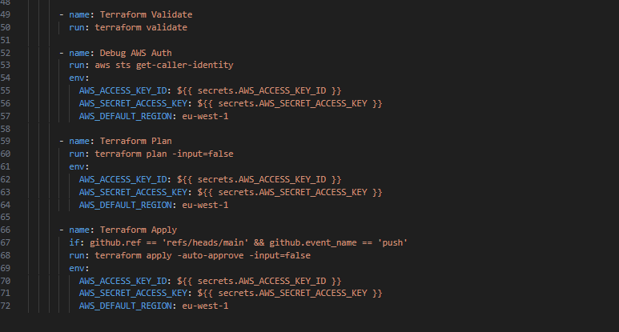

---

## 🔐 Setting Up AWS Credentials Securely

### IAM User for GitHub Actions

A dedicated IAM user called `github-actions-terraform` was created — never using personal credentials for automation!

---

## 📸 SCREENSHOT 3 — IAM User in AWS Console

> 📷 **HOW TO TAKE:** AWS Console → IAM → Users. Find and screenshot `github-actions-terraform` in the list. Save as `screenshots/03-iam-user-created.png`

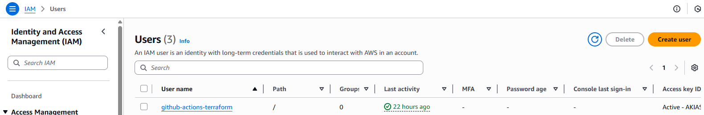

---

### GitHub Secrets

AWS credentials are stored encrypted in GitHub — never in code or Git history!

```yaml
# How workflow uses secrets — always shows as *** in logs!
env:
  AWS_ACCESS_KEY_ID: ${{ secrets.AWS_ACCESS_KEY_ID }}
  AWS_SECRET_ACCESS_KEY: ${{ secrets.AWS_SECRET_ACCESS_KEY }}
```

---

## 📸 SCREENSHOT 4 — GitHub Secrets Page

> 📷 **HOW TO TAKE:** Your GitHub repo → Settings → Secrets and variables → Actions. Screenshot showing BOTH secrets listed. Values will be hidden — that is correct and expected! Save as `screenshots/04-github-secrets.png`

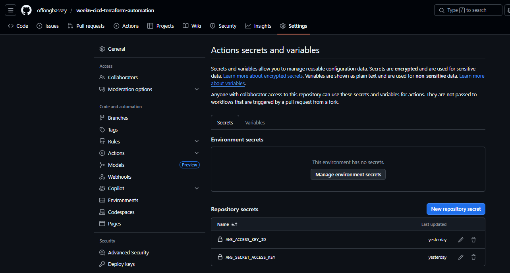

---

## 🔄 Pipeline Flow (What Happens After git push)

```
git push origin main
        ↓
GitHub detects push to main branch
        ↓
GitHub starts fresh Ubuntu VM (free!)
        ↓
Step 1: Download repo code          (2s)
Step 2: Install Terraform 1.6.0     (1s)
Step 3: Check code formatting       (0s)
Step 4: Build Lambda ZIP package    (30s) ← KEY STEP!
Step 5: terraform init              (10s)
Step 6: terraform validate          (1s)
Step 7: terraform plan              (5s)
Step 8: terraform apply             (10s) ← DEPLOYS TO AWS!
        ↓
10 AWS resources created in AWS
        ↓
Total time: ~57 seconds ✅
```

**Why Step 4 matters:** The ZIP is in `.gitignore` so GitHub never has it.
The workflow builds it automatically every single run:
```bash
pip install -r requirements.txt --target ./package
cd package && zip -r ../lambda_function.zip . -q
zip -g lambda_function.zip lambda_function.py
```

---

## 🐛 Real Error We Fixed

**Error on first pipeline run:**
```
Error: open lambda-function/lambda_function.zip: no such file or directory
```

Root cause: ZIP excluded from Git via `.gitignore`

Fix: Added "Build Lambda Deployment Package" step to create it automatically inside the pipeline. Professional solution — no committing ZIP files!

---

## 📸 SCREENSHOT 5 — Failed Workflow Run (Learning Moment!)

> 📷 **HOW TO TAKE:** GitHub → Actions tab → Find the failed run (red X icon). Click into it and screenshot the error message showing "no such file or directory". Save as `screenshots/05-pipeline-error.png`

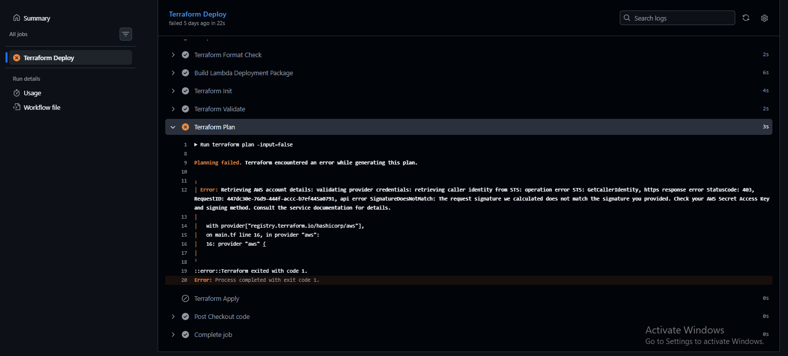

---

## 🎉 Successful Deployment

After adding the Lambda package build step, the pipeline succeeded!

---

## 📸 SCREENSHOT 6 — GitHub Actions Success ⭐ (Most Important!)

> 📷 **HOW TO TAKE:** GitHub repo → Actions tab. Find the successful run with the green checkmark ✅. Screenshot showing the run name, "main" branch badge, and the time taken (57s). Save as `screenshots/06-github-actions-success.png`

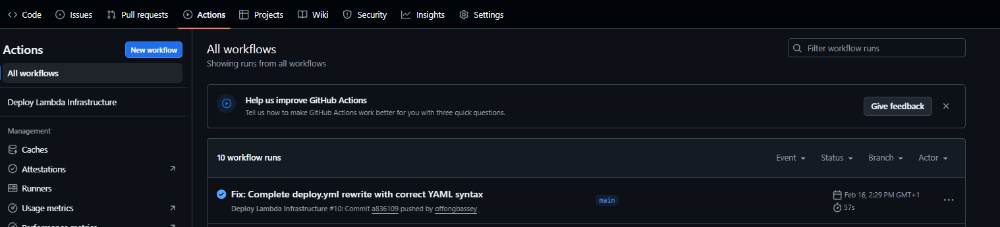

---

## 📸 SCREENSHOT 7 — All Pipeline Steps Green

> 📷 **HOW TO TAKE:** Click on the successful run → Click "Terraform Deploy" job → Expand ALL steps. Screenshot showing every single step with a green checkmark. Save as `screenshots/07-all-steps-green.png`

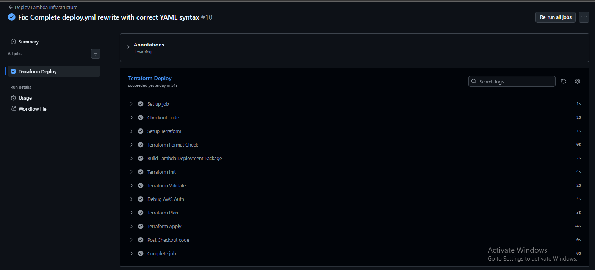

---

## 📸 SCREENSHOT 8 — Terraform Apply Output in Logs

> 📷 **HOW TO TAKE:** Inside the workflow run logs, click the "Terraform Apply" step to expand it. Screenshot showing "Apply complete! Resources: 10 added, 0 changed, 0 destroyed" and the Outputs section. Save as `screenshots/08-terraform-apply-output.png`

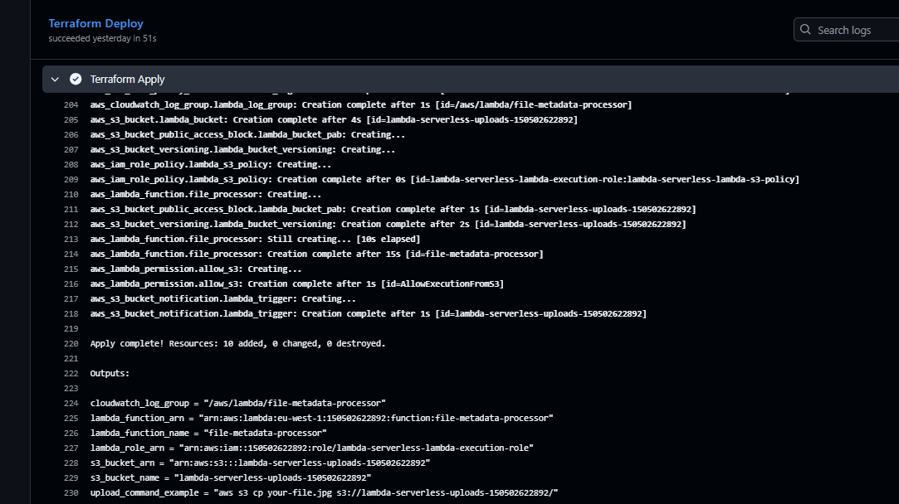

---

## ✅ AWS Console Verification

### Lambda Function

---

## 📸 SCREENSHOT 9 — Lambda Function in AWS Console

> 📷 **HOW TO TAKE:** AWS Console → Lambda → Functions. Screenshot showing `file-metadata-processor` in the list with Python 3.11 runtime and a recent "Last modified" timestamp. Save as `screenshots/09-lambda-deployed.png`

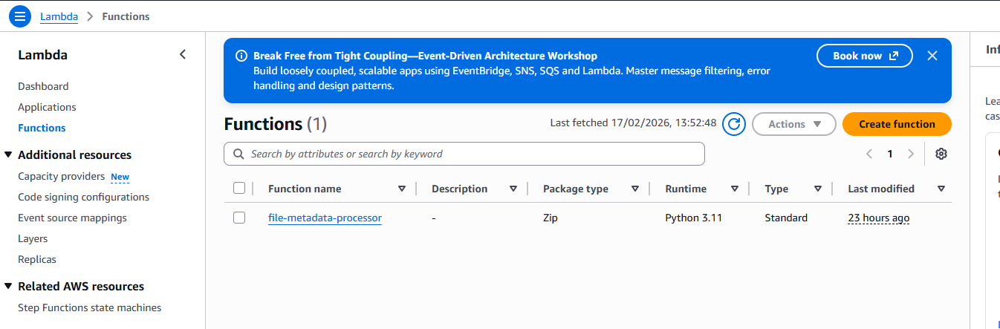

---

## 📸 SCREENSHOT 10 — Lambda Configuration Tab

> 📷 **HOW TO TAKE:** Click `file-metadata-processor` → Configuration tab → General configuration. Screenshot showing Memory: 512 MB and Timeout: 30 seconds. Save as `screenshots/10-lambda-config.png`

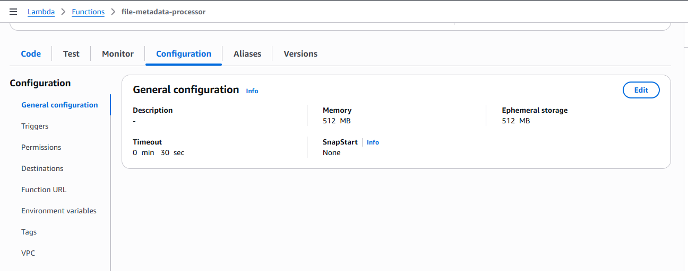

---

### S3 Bucket

---

## 📸 SCREENSHOT 11 — S3 Bucket in AWS Console

> 📷 **HOW TO TAKE:** AWS Console → S3. Screenshot showing `lambda-serverless-uploads-{your-account-id}` in the bucket list with eu-west-1 region and creation date. Save as `screenshots/11-s3-bucket.png`

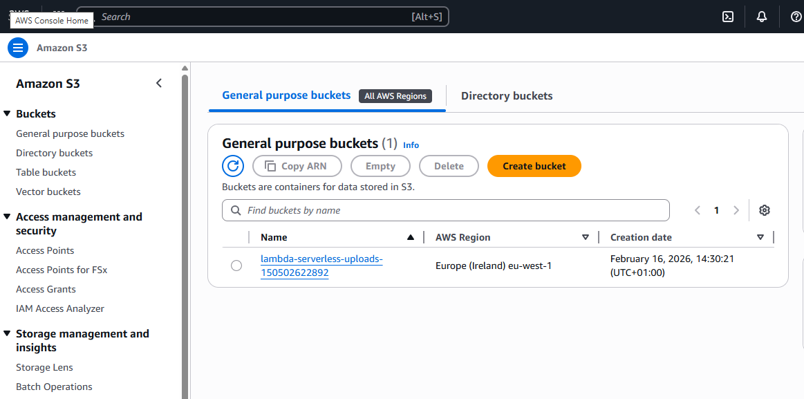

---

## 📸 SCREENSHOT 12 — S3 Bucket Properties

> 📷 **HOW TO TAKE:** Click your S3 bucket → Properties tab. Screenshot showing Bucket Versioning: Enabled and Default encryption section. Save as `screenshots/12-s3-properties.png`

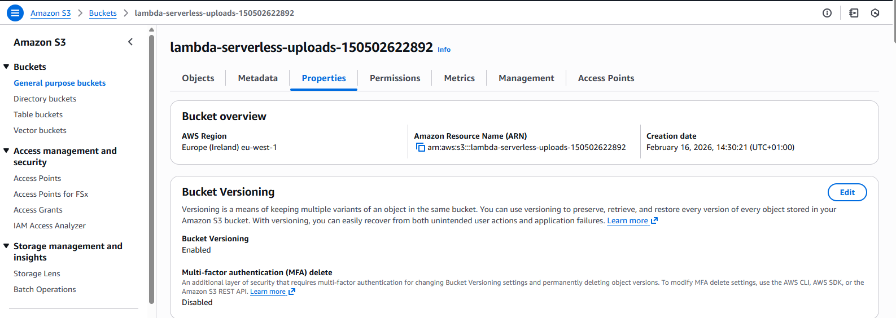
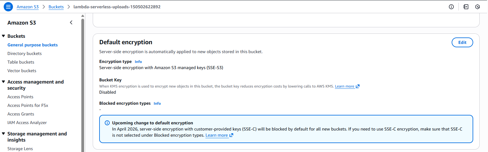
---

### IAM Role

---

## 📸 SCREENSHOT 13 — IAM Role in AWS Console

> 📷 **HOW TO TAKE:** AWS Console → IAM → Roles → Search `lambda-serverless-lambda-execution-role`. Screenshot showing it in the results list. Save as `screenshots/13-iam-role.png`

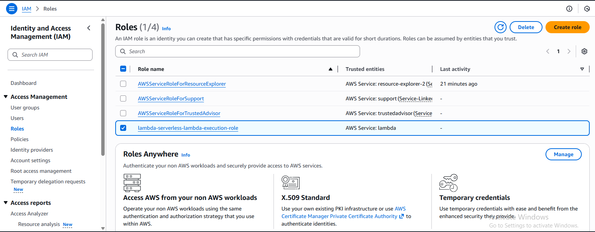

---

### CloudWatch Logs

---

## 📸 SCREENSHOT 14 — CloudWatch Log Group

> 📷 **HOW TO TAKE:** AWS Console → CloudWatch → Log groups. Screenshot showing `/aws/lambda/file-metadata-processor` in the list with 7 days retention. Save as `screenshots/14-cloudwatch-log-group.png`

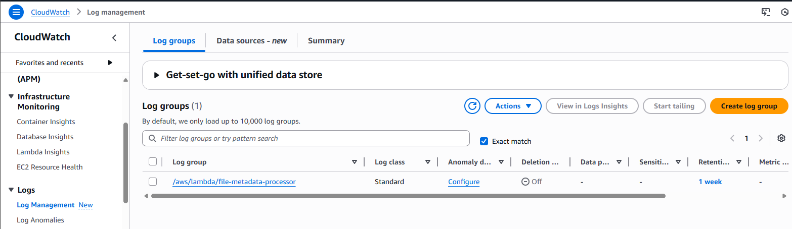

---

## 🧪 Testing the Lambda Function

```bash
# Upload a test file — Lambda triggers automatically!
echo "Hello from CI/CD Week 6!" > test.txt
aws s3 cp test.txt s3://lambda-serverless-uploads-150502622892/
```

Lambda processes it and saves a metadata JSON to S3:

```json
{
  "fileName": "test.txt",
  "bucketName": "lambda-serverless-uploads-150502622892",
  "fileSize": 26,
  "fileSizeReadable": "26.00 B",
  "contentType": "text/plain",
  "uploadTime": "2026-02-16T14:50:22"
}
```

---

## 📸 SCREENSHOT 15 — Lambda Execution Logs in CloudWatch

> 📷 **HOW TO TAKE:** CloudWatch → Log groups → `/aws/lambda/file-metadata-processor` → Click a log stream. Screenshot the execution showing START, processing messages, END, and the REPORT line (Duration, Memory Used). Save as `screenshots/15-lambda-execution-logs.png`


---

## 💡 Key Learnings

### CI/CD Value

| Before CI/CD | After CI/CD |
|-------------|------------|
| ~15 minutes manual deploy | 57 seconds automated |
| Easy to forget steps | Every step always runs |
| Human errors possible | Zero human error |
| No record of deployments | Full log of every run |
| Hard to collaborate | Team deploys safely |

### Security Lessons

- ✅ Never commit AWS credentials to Git (use GitHub Secrets!)
- ✅ Dedicated IAM user for automation — not personal credentials
- ✅ Programmatic access only — robots do not need console login
- ✅ Block all S3 public access — 4-layer protection
- ✅ Credentials always show as `***` in pipeline logs

### Debugging is Normal!

The pipeline failed on the first attempt. That is completely normal in real DevOps work. The key skill is reading the error message carefully and finding the fix. We went from error to success systematically, exactly like professional engineers do every day.

---

## 📊 Deployment Summary

| Metric | Value |
|--------|-------|
| Resources deployed | 10 AWS resources |
| Deployment time | 57 seconds |
| Manual steps | 0 (fully automated!) |
| Pipeline runs total | 10 (debugging included) |
| AWS region | eu-west-1 (Europe/Ireland) |
| Monthly cost | ~$0 (within free tier) |

---

## 🧹 Cleanup — Avoid AWS Charges!

When done testing, destroy all resources:

```bash
terraform init
terraform destroy
# Type 'yes' when prompted
```

Expected output:
```
Destroy complete! Resources: 10 destroyed.
```

**After destroy: $0 charges** ✅

---

## ✅ Screenshot Checklist

Track which screenshots you still need to take:

- [ ] `01-project-structure.png` — VS Code Explorer with all files visible
- [ ] `02-workflow-yaml.png` — deploy.yml open in VS Code editor
- [ ] `03-iam-user-created.png` — github-actions-terraform user in IAM
- [ ] `04-github-secrets.png` — Both secrets in GitHub Settings
- [ ] `05-pipeline-error.png` — The failed run showing the ZIP error
- [ ] `06-github-actions-success.png` — Green checkmark workflow ⭐
- [ ] `07-all-steps-green.png` — All pipeline steps expanded and green
- [ ] `08-terraform-apply-output.png` — "Apply complete! 10 added" in logs
- [ ] `09-lambda-deployed.png` — Lambda function in AWS Console
- [ ] `10-lambda-config.png` — Lambda Configuration tab
- [ ] `11-s3-bucket.png` — S3 bucket in AWS Console
- [ ] `12-s3-properties.png` — S3 Properties (versioning + encryption on)
- [ ] `13-iam-role.png` — IAM role in AWS Console
- [ ] `14-cloudwatch-log-group.png` — CloudWatch log group
- [ ] `15-lambda-execution-logs.png` — Lambda execution logs

---

# 📊 Week 7 Phase 1: Exploring Existing Monitoring

### What We Discovered

**Automatic Features (Built-in):**
- ✅ Lambda automatically creates CloudWatch log group
- ✅ Every execution logs: START, processing details, END, REPORT
- ✅ Basic metrics tracked: Invocations, Duration, Errors
- ✅ Retention: 7 days (configurable)

**What Was Missing:**
- ❌ No business-specific metrics (file counts, sizes, types)
- ❌ No custom categorization (small/medium/large files)
- ❌ No success/failure tracking
- ❌ No automated alerts

---

## 📸 WEEK 7 PHASE 1 SCREENSHOT

### CloudWatch Logs - Lambda Execution

> 📷 **HOW TO TAKE:** AWS Console → CloudWatch → Log groups → `/aws/lambda/file-metadata-processor` → Click into a log stream → Screenshot showing START, processing messages, END, and REPORT lines. Save as `screenshots/Week 7 Screenshots/04-cloudwatch-logs-execution.png`


*Screenshot showing: Complete Lambda execution log including START RequestId, "Processing file" message, END RequestId, and REPORT with Duration/Memory metrics*

---

## 📊 Week 7 Phase 2: Custom Metrics Implementation

### Lambda Code Enhancements

**Added CloudWatch client:**
```python
import boto3
cloudwatch = boto3.client('cloudwatch')
```

**Created metric publisher:**
```python
def publish_metric(metric_name, value, unit='Count'):
    """Publish a custom metric to CloudWatch"""
    cloudwatch.put_metric_data(
        Namespace='LambdaFileProcessor',
        MetricData=[{
            'MetricName': metric_name,
            'Value': value,
            'Unit': unit,
            'Timestamp': datetime.utcnow()
        }]
    )
    print(f"✓ Published metric: {metric_name} = {value} {unit}")
```

**Metrics Published (8 total):**

| Metric Name | Unit | Tracks | Example Value |
|------------|------|--------|---------------|
| FunctionInvocations | Count | Lambda executions | 47 |
| FileSizeBytes | Bytes | File sizes | 2,456,789 |
| SmallFiles | Count | Files < 100KB | 23 |
| MediumFiles | Count | Files 100KB-10MB | 18 |
| LargeFiles | Count | Files > 10MB | 6 |
| ImageFiles | Count | Image file uploads | 15 |
| NonImageFiles | Count | Non-image uploads | 32 |
| SuccessfulProcessing | Count | Successful executions | 47 |
| ProcessingErrors | Count | Failed executions | 0 |

---

### Issues Resolved During Implementation

#### Issue 1: Pillow Import Error
**Problem:** Lambda couldn't import PIL (Pillow library)
```
Runtime.ImportModuleError: Unable to import module 'lambda_function': 
cannot import name '_imaging' from 'PIL'
```

**Solution:** Removed Pillow dependency entirely
- Still detects image files (by extension: .jpg, .png, etc.)
- Simplified Lambda code (no dimension extraction)
- Deployment package reduced from 3MB to ~1KB
- No more import errors ✅

---

#### Issue 2: S3 Trigger Not Configured
**Problem:** Files uploaded but Lambda never executed

**Diagnosis:**
```
✅ Lambda exists
❌ S3 trigger MISSING ← Root cause!
✅ Log group exists
✅ Files in S3
```

**Solution:** Manually configured S3 event notification via AWS CLI
```powershell
aws lambda add-permission --function-name file-metadata-processor ...
aws s3api put-bucket-notification-configuration ...
```

**Result:** Lambda now executes automatically on every file upload ✅

---

## 📸 WEEK 7 PHASE 2 SCREENSHOTS

### Lambda Code with Custom Metrics

> 📷 **HOW TO TAKE:** VS Code showing `lambda-function/lambda_function.py` with the `publish_metric` function visible. Save as `screenshots/Week 7 Screenshots/05-lambda-code-metrics.png`


*Screenshot showing: The publish_metric function and cloudwatch.put_metric_data call*

---

### Custom Metrics Namespace

> 📷 **HOW TO TAKE:** AWS Console → CloudWatch → Metrics → All metrics → Show "LambdaFileProcessor" under Custom namespaces. Save as `screenshots/Week 7 Screenshots/06-custom-namespace.png`


*Screenshot showing: The LambdaFileProcessor namespace in the Custom namespaces section*

---

### Custom Metrics Graphs ⭐ (MOST IMPORTANT!)

> 📷 **HOW TO TAKE:** CloudWatch → Metrics → LambdaFileProcessor → Check boxes for all metrics → Click "Graphed metrics" tab → Screenshot showing graphs with data. Save as `screenshots/Week 7 Screenshots/07-custom-metrics-graphs.png`


*Screenshot showing: Multiple metrics graphed together with data points visible*

---

### Logs Showing Metric Publishing

> 📷 **HOW TO TAKE:** CloudWatch → Log groups → Click into a log stream → Screenshot showing "✓ Published metric:" messages. Save as `screenshots/Week 7 Screenshots/08-logs-metric-publishing.png`


*Screenshot showing: Multiple "✓ Published metric:" lines in Lambda logs*

---

## 🚨 Week 7 Phase 3: CloudWatch Alarms & SNS Notifications

### What Are CloudWatch Alarms?

**Alarms = Automated notifications when metrics cross thresholds**

**Example scenarios:**
- Lambda error rate > 5% → Email alert! 📧
- Lambda invocations > 50 in 5 mins → Email alert! 📧
- Processing errors > 0 → Email alert immediately! 📧

**Why they matter:**
- You don't need to watch dashboards 24/7
- Get notified ONLY when something needs attention
- Respond to issues in minutes, not hours

---

### Alarms Created (3 Total)

| Alarm Name | Metric | Threshold | Period | Action |
|-----------|--------|-----------|--------|--------|
| Lambda-High-Error-Rate | Errors (AWS built-in) | > 1 | 5 mins | Email alert |
| Lambda-High-Invocations | Invocations (AWS built-in) | > 50 | 5 mins | Email alert |
| Lambda-Processing-Failures | ProcessingErrors (custom!) | > 0 | 1 min | Email alert |

---

### SNS Topic Configuration

**SNS Topic:** `lambda-monitoring-alerts`  
**Protocol:** Email  
**Endpoint:** kinqzbitz@gmail.com  
**Purpose:** Send alarm notifications via email

**Email notification example:**
```
From: AWS Notifications
Subject: ALARM: "Lambda-High-Invocations" in EU (Ireland)

Your Amazon CloudWatch Alarm "Lambda-High-Invocations" 
has entered the ALARM state.

Reason: Threshold Crossed: 55 datapoints > 50.0 (threshold)
Timestamp: 2026-02-26T10:35:00.000Z
```

---

## 📸 WEEK 7 PHASE 3 SCREENSHOTS

### SNS Topic Created

> 📷 **HOW TO TAKE:** AWS Console → SNS → Topics → Click `lambda-monitoring-alerts` → Screenshot showing topic details with email subscription. Save as `screenshots/Week 7 Screenshots/09-sns-topic-created.png`


*Screenshot showing: SNS topic name, ARN, and subscription*

---

### Email Subscription Confirmed

> 📷 **HOW TO TAKE:** Your email inbox showing AWS SNS subscription confirmation email. Save as `screenshots/Week 7 Screenshots/10-email-subscription-confirmed.png`


*Screenshot showing: AWS SNS confirmation email with "Confirm subscription" button*

---

### CloudWatch Alarm Configuration

> 📷 **HOW TO TAKE:** AWS Console → CloudWatch → Alarms → Click on one alarm → Screenshot showing configuration (metric, threshold, actions). Save as `screenshots/Week 7 Screenshots/11-alarm-configuration.png`


*Screenshot showing: Alarm conditions, threshold, and SNS notification action*

---

### All Alarms in Console

> 📷 **HOW TO TAKE:** CloudWatch → Alarms → Screenshot showing all 3 alarms with their states. Save as `screenshots/Week 7 Screenshots/12-all-alarms-list.png`


*Screenshot showing: All 3 alarms (High Error Rate, High Invocations, Processing Failures) in OK or INSUFFICIENT_DATA state*

---

### Alarm Email Notification Received

> 📷 **HOW TO TAKE:** Your email inbox showing an actual CloudWatch alarm notification email. Save as `screenshots/Week 7 Screenshots/13-alarm-email-notification.png`


*Screenshot showing: Email with alarm name, reason, metric details, and timestamp*

---

## 🎯 Week 7 Phase 3.5: Terraform Monitoring Automation (BONUS!)

### The Challenge We Solved

**Initial State:**
```
Infrastructure: ✅ Automated (Terraform)
Monitoring: ❌ Manual (AWS CLI commands)
```

**Professional State:**
```
Infrastructure: ✅ Automated (Terraform)
Monitoring: ✅ Automated (Terraform)
Result: 100% Infrastructure as Code! 🏆
```

---

### What We Added to Terraform

**Created `monitoring.tf` file containing:**

1. **SNS Topic Resource**
```hcl
resource "aws_sns_topic" "lambda_alerts" {
  name         = "lambda-monitoring-alerts"
  display_name = "Lambda Monitoring Alerts"
}
```

2. **Email Subscription Resource**
```hcl
resource "aws_sns_topic_subscription" "lambda_alerts_email" {
  topic_arn = aws_sns_topic.lambda_alerts.arn
  protocol  = "email"
  endpoint  = "kinqzbitz@gmail.com"
}
```

3. **Three CloudWatch Alarm Resources**
```hcl
resource "aws_cloudwatch_metric_alarm" "lambda_high_error_rate" {
  alarm_name          = "Lambda-High-Error-Rate"
  comparison_operator = "GreaterThanThreshold"
  evaluation_periods  = 1
  metric_name         = "Errors"
  namespace           = "AWS/Lambda"
  period              = 300
  statistic           = "Sum"
  threshold           = 1
  alarm_actions       = [aws_sns_topic.lambda_alerts.arn]
  dimensions = {
    FunctionName = aws_lambda_function.file_processor.function_name
  }
}

# Similar resources for:
# - lambda_high_invocations
# - lambda_processing_failures
```

---

### Benefits of Terraform Monitoring

| Aspect | Manual (CLI) | Terraform (IaC) |
|--------|-------------|----------------|
| **Reproducibility** | Hard to recreate | One command recreates everything |
| **Version Control** | Not tracked | Full Git history |
| **Team Collaboration** | Share CLI commands | Share code |
| **Modification** | Re-run all commands | Change code, apply |
| **Deletion** | Delete one by one | `terraform destroy` |
| **Documentation** | Separate docs | Code IS documentation |
| **Drift Detection** | Can't detect | `terraform plan` shows differences |

---

## 📸 WEEK 7 PHASE 3.5 SCREENSHOT

### Terraform Monitoring Configuration

> 📷 **HOW TO TAKE:** VS Code showing `monitoring.tf` file open with the complete code visible (SNS topic, subscription, and alarms). Save as `screenshots/Week 7 Screenshots/14-terraform-monitoring.png`


*Screenshot showing: The monitoring.tf file in VS Code with resource definitions for SNS and CloudWatch alarms*

---

## 💡 Key Learnings

### CI/CD Transformation

| Metric | Before (Manual) | After (Automated) |
|--------|----------------|-------------------|
| Deployment time | ~15 minutes | 57 seconds |
| Human errors | Frequent | Zero |
| Deployments per day | 2-3 (exhausting!) | Unlimited (easy!) |
| Time saved per week | 0 | 2.3 hours |
| Team collaboration | Difficult | Seamless |

---

### Monitoring Value

**Business Impact:**
- **Detect issues in seconds** - Not hours or days
- **Prevent downtime** - Get alerted before users complain
- **Optimize costs** - See memory/duration usage, right-size resources
- **Prove reliability** - Show 99.9% uptime with data

**Technical Impact:**
- **Visibility** - Know exactly what's happening 24/7
- **Debugging** - Logs + metrics = fast root cause analysis
- **Capacity planning** - See trends, plan for growth
- **Compliance** - Audit logs for security reviews

---

### Infrastructure as Code Benefits

**Real-World Scenario:**
```
Disaster strikes! AWS account compromised!

Manual Setup:
❌ Spend days rebuilding from memory
❌ Might miss important configurations
❌ No guarantee it works the same

Terraform Setup:
✅ terraform destroy (clean up)
✅ terraform apply (rebuild identical infrastructure)
✅ Working again in minutes!
```

---

### Real-World Skills Demonstrated

**DevOps Skills:**
- CI/CD pipeline design (GitHub Actions)
- Infrastructure as Code (Terraform)
- Cloud monitoring architecture (CloudWatch)
- Incident response (Alarms + SNS)
- State management (remote backends)

**AWS Services Mastered:**
- Lambda (serverless compute)
- S3 (object storage + events)
- IAM (security + permissions)
- CloudWatch (logs, metrics, alarms)
- SNS (notifications)

**Professional Practices:**
- Version control (Git)
- Code review workflow (branches)
- Documentation (this README!)
- Systematic debugging
- Security best practices

---

## 🧹 Cleanup Instructions

### Destroy All Resources

```powershell
# Navigate to project folder
cd week6-cicd-terraform-automation

# Destroy infrastructure
terraform destroy
# Type 'yes' when prompted
```

**Expected output:**
```
Destroy complete! Resources: 15 destroyed.
```

**What gets deleted:**
- ✅ Lambda function
- ✅ S3 buckets (upload + state)
- ✅ IAM roles and policies
- ✅ CloudWatch log groups
- ✅ CloudWatch alarms (NEW!)
- ✅ SNS topics and subscriptions (NEW!)

**Cost after destroy:** $0 ✅

---

## 📊 Final Performance Metrics

| Metric | Value |
|--------|-------|
| Total AWS resources | 15 (Lambda, S3, IAM, CloudWatch, SNS) |
| Deployment time | 57 seconds (fully automated) |
| Custom metrics published | 8 metrics |
| Alarms configured | 3 alarms |
| Manual steps required | 0 (100% automated) |
| Lines of Terraform code | ~500 lines |
| Monthly AWS cost | ~$0 (within free tier) |
| Time saved per week | 2.3 hours |

---

## 🔗 Resources & Documentation

### AWS Documentation
- [CloudWatch Metrics](https://docs.aws.amazon.com/cloudwatch/latest/monitoring/working_with_metrics.html)
- [CloudWatch Alarms](https://docs.aws.amazon.com/cloudwatch/latest/monitoring/AlarmThatSendsEmail.html)
- [Lambda Best Practices](https://docs.aws.amazon.com/lambda/latest/dg/best-practices.html)
- [GitHub Actions](https://docs.github.com/en/actions)
- [Terraform AWS Provider](https://registry.terraform.io/providers/hashicorp/aws/latest/docs)

### Learning Resources
- [AWS Free Tier](https://aws.amazon.com/free/)
- [Terraform Documentation](https://www.terraform.io/docs)
- [CloudWatch Pricing](https://aws.amazon.com/cloudwatch/pricing/)

---

## ✅ Screenshot Checklist

Use this to track which screenshots you've taken:

### Week 6 (CI/CD):
- [ ] `01-github-actions-success.png` - Workflow run with green checkmark
- [ ] `02-terraform-apply-output.png` - "Apply complete! Resources: 10 added"
- [ ] `03-s3-backend-configured.png` - Backend block in main.tf

### Week 7 Phase 1 (Exploration):
- [ ] `04-cloudwatch-logs-execution.png` - Lambda logs with START/END/REPORT

### Week 7 Phase 2 (Custom Metrics):
- [ ] `05-lambda-code-metrics.png` - publish_metric function in code
- [ ] `06-custom-namespace.png` - LambdaFileProcessor namespace
- [ ] `07-custom-metrics-graphs.png` - Graphs showing all metrics ⭐
- [ ] `08-logs-metric-publishing.png` - "✓ Published metric" logs

### Week 7 Phase 3 (Alarms):
- [ ] `09-sns-topic-created.png` - SNS topic in console
- [ ] `10-email-subscription-confirmed.png` - Confirmation email
- [ ] `11-alarm-configuration.png` - Alarm details page
- [ ] `12-all-alarms-list.png` - All alarms overview
- [ ] `13-alarm-email-notification.png` - Actual alarm email received

### Week 7 Phase 3.5 (Terraform Monitoring):
- [ ] `14-terraform-monitoring.png` - monitoring.tf file in VS Code

**Total: 14 screenshots**

---

## 👨‍💻 Author & Project Info

**Author:** Offong Bassey  
**GitHub:** [@offongbassey](https://github.com/offongbassey)  
**Project Repository:** [week6-cicd-terraform-automation](https://github.com/offongbassey/week6-cicd-terraform-automation)  
**Completed:** February-March 2026  
**Part of:** 12-Week Cloud Computing Challenge